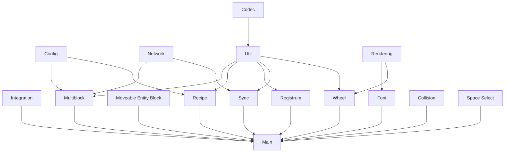
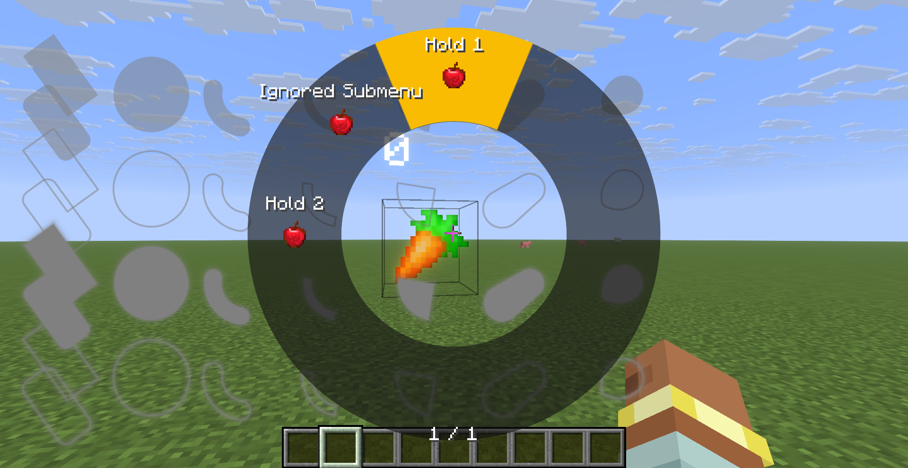

<div align="center" style="align-items: center">


</div>

# AnvilLib

**AnvilLib** 是由 [Anvil Dev](https://github.com/Anvil-Dev) 开发的开源 NeoForge 模组库，为 Minecraft 模组开发者提供*
*开箱即用的工具与框架**。无论你是初次接触模组开发的新手，还是经验丰富的 Modder，AnvilLib 都能帮你省去大量重复劳动，把精力真正放在创意实现上。

> 如果觉得有帮助，欢迎点个 Star ⭐ 或者加入 [QQ 群]() 一起交流。

---

## ✨ 为什么选择 AnvilLib？

| 特性                      | 说明                              |
|-------------------------|---------------------------------|
| 🧩 **15+ 独立模块**         | 按需引入，不拖累构建体积。只需依赖你真正需要的模块       |
| 🔧 **流式 API 设计**        | 链式调用，IDE 自动补全友好，大幅减少注册样板代码      |
| 📦 **Maven Central 发布** | 无需额外仓库配置，直接 `mavenCentral()` 即可 |
| 🔄 **活跃维护**             | 持续适配最新 NeoForge 版本，社区反馈快速响应     |



---

## 🚀 30 秒快速开始

### 添加依赖

```groovy
// settings.gradle
pluginManagement {
    repositories {
        maven { url "https://maven.neoforged.net/releases" }
        mavenCentral()
    }
}

// build.gradle
repositories { mavenCentral() }
dependencies {
    implementation "dev.anvilcraft.lib:anvillib-neoforge-26.1:2.0.0"
}
```

### 第一个注册项

```java
@Mod("mymod")
public class MyMod {
    public static final Registrum REGISTRUM = Registrum.create("mymod");

    public static final BlockEntry<MyBlock> MY_BLOCK = REGISTRUM
        .object("my_block")
        .block(MyBlock::new)          // 注册方块
            .simpleItem()              // 自动创建 BlockItem
            .lang("My Block")          // 自动生成语言文件
            .tag(BlockTags.MINEABLE_WITH_PICKAXE) // 自动添加标签
            .register();

    public MyMod(IEventBus modBus) {
        // 就这么简单 —— 方块、物品、模型、战利品表、标签已全部就绪
    }
}
```

---

## 🧩 模块详解

### 📦 注册与配置

#### Registrum — 声明式注册系统

告别冗长的 `DeferredRegister` 样板代码。一条链式调用完成方块 + BlockItem + 模型 + 战利品表 + 标签的全套注册。

```java
// 方块 + 物品 + 方块实体 + 渲染器，一气呵成
public static final BlockEntry<MyMachine> MACHINE = REGISTRUM
    .object("machine")
    .block(MyMachine::new)
        .simpleItem()                                       // BlockItem
        .blockEntity(MyMachineEntity::new)                  // 方块实体
            .renderer(() -> ctx -> new MachineRenderer(ctx)) // TESR 渲染器
            .build()
        .tag(BlockTags.MINEABLE_WITH_PICKAXE, BlockTags.NEEDS_IRON_TOOL)
        .register();

// 物品注册
public static final ItemEntry<MyItem> MY_ITEM = REGISTRUM
    .object("my_item")
    .item(MyItem::new)
        .tab(CreativeModeTabs.TOOLS)  // 自动放入创造模式标签页
        .burnTime(200)                // 燃料燃烧时间 (ticks)
        .register();
```

**更多功能**：内建数据生成器（模型/配方/战利品表/标签/语言文件），支持自定义注册表，Entity/Fluid/Menu 构建器，Type-safe Entry
引用。

#### Config — 注解驱动的配置系统

```java
@Config(name = "mymod", type = ModConfig.Type.COMMON)
public class MyConfig {
    @Comment("Maximum processing speed (ticks per operation)")
    @BoundedDiscrete(min = 1, max = 200)
    public int speed = 20;

    @Comment("Whether to enable experimental features")
    public boolean experimental = false;
}

// 一行注册，自动生成 TOML + 配置界面
public static final MyConfig CONFIG = ConfigManager.register("mymod", MyConfig::new);
```

`@BoundedDiscrete` 自动设置数值滑块范围，`@Comment` 转换为工具提示，支持嵌套对象折叠 (`@CollapsibleObject`)。

---

### 🌐 网络与数据同步

#### Network — 自动扫描注册

```java
// package-info.java
@Network(protocol = PacketProtocol.PLAY)
package com.example.network;

// 定义数据包
public record MyPacket(int value) implements IClientboundPacket {
    public static final Type<MyPacket> TYPE = new Type<>(id("my_packet"));
    public static final StreamCodec<ByteBuf, MyPacket> STREAM_CODEC = ...;

    @Override
    public void handleOnClient(Player player) {
        // 客户端处理逻辑
    }
}

// 一行搞定注册
NetworkRegistrar.register(registrar, "mymod");
```

**4 种包类型**：`IClientboundPacket`(S→C) / `IServerboundPacket`(C→S) / `IInsensitiveBiPacket`(双端同逻辑) /
`ISensitiveBiPacket`(双端异逻辑)。  
**3 种协议**：PLAY / CONFIGURATION / COMMON，自动适配。

#### Sync — 零代码字段同步

```java
@Sync(SyncDirection.BOTH)  // 双向同步
public class SyncedData {
    public final SyncProxy<Integer> health = new SyncProxy<>(20);
    public final SyncProxy<Float> speed = new SyncProxy<>(0.1f);
    public final SyncProxy<CompoundTag> extra = new SyncProxy<>(new CompoundTag());
}

// 在 Entity/BlockEntity 中使用
public class MyEntity extends Entity {
    public final SyncedData data = new SyncedData();

    public void tick() {
        data.health.setValue(data.health.getValue() - 1);
        // ↑ 自动同步到客户端，无需手动发包！
    }
}
```

**18 种内置类型** 自动匹配 StreamCodec（int/long/String/BlockPos/ItemStack/CompoundTag...），自定义类型提供 Codec 即可。  
**维度感知分发**：自动选择 sendToPlayersTrackingChunk / sendToPlayersTrackingEntity / sendToAllPlayers 最优策略。

#### Codec — 高频序列化工具

```java
// Minecraft 对象的 Codec
Codec<Item> itemCodec = CodecUtil.ITEM;
Codec<Block> blockCodec = CodecUtil.BLOCK;
MapCodec<BlockState> stateCodec = CodecUtil.BLOCK_STATE_MAP_CODEC;

// 方块状态属性编解码
MapCodec<BlockState> props = CodecUtil.blockStatePropertiesCodec(state);

// 枚举编解码（按序数或小写名称）
Codec<Direction> dirCodec = CodecUtil.enumCodecInLowerName(Direction.class);
```

---

### 🎨 渲染与 GUI

#### Rendering — 渲染工具箱

**Bloom 泛光后处理**：多 Pass 处理链（下采样→上采样→混合），通过 Compound 提交系统实现泛光物体渲染。

```java
// 通过 bloom 实例创建 Compound 存储，然后在其上提交渲染
CompoundSubmitNodeStorage compoundSubmit =
    ALRPostEffects.getBloomPostEffect().createCompoundSubmitStorage(submitNodeCollector);

// 在 CachedBlockEntityRenderer 的 submit 方法中使用
renderState.submit(poseStack, compoundSubmit, light, overlay, 0);
```

**Cached BlockEntity Rendering**：缓存式方块实体渲染管线，仅在数据变更时重建渲染状态，显著减少 CPU 开销。

```java
// 实现 CachedBlockEntityRenderer 接口
public class MyBERenderer implements CachedBlockEntityRenderer<MyBE, MyState> {
    public MyState extractRenderState(MyBE be, MyState state, float partialTicks, Camera camera) { ... }
    public void submit(MyState state, PoseStack poseStack, SubmitNodeCollector collector, CameraRenderState camera) { ... }
}
```

**UBO 框架**：类型安全的 STD140 Uniform Buffer Object 布局定义，自动计算对齐和大小。  
**SDF 2D 图形绘制**：7 种图形（BOX/CIRCLE/ARC/SECTOR/PIE/CAPSULE/EGG）+ 填充/发光 Pass + 碰撞检测。

#### Font — SDF 字体渲染

使用系统 AWT 字体，CPU 端生成 SDF 字形图集，GPU 端通过自定义 Shader 渲染清晰文字。

```java
// 获取用户配置的字体
java.awt.Font font = AnvilLibFont.getSelectFont();

// 绘制文字
graphics.anvillib$text(font, "Hello World", x, y, 0xFFFFFFFF);
graphics.anvillib$centeredText(font, Component.literal("AnvilLib"), x, y, 0xFFFFD700);

// 支持粗体/斜体/下划线/删除线/乱码/styles
graphics.anvillib$text(font,
    Component.literal("Bold & Italic").withStyle(Style.EMPTY.withBold(true).withItalic(true)),
    x, y, 0xFFFFFFFF);
```

支持自动换行、居中、带背景色文字、文本宽度测量 (`ALFont`)。

#### Wheel — 轮盘菜单

```java
WheelMenuModel menu = WheelMenuBuilder.create()
    .entry("home",      Items.OAK_SAPLING,   (ctx) -> action(ctx))
    .entry("settings",  Items.COMPARATOR,     (ctx) -> action(ctx))
    .entry("info",      Items.BOOK,           (ctx) -> action(ctx))
    .slotsPerPage(8)
    .selectionEffect(WheelSelectionEffect.ANNULAR_SECTOR)
    .build();
```

支持圆点/扇形高亮选中效果、多页翻页、长按/点击两种开启模式、子菜单嵌套。

<!-- 📸 渲染模块效果合集（建议对比图: Bloom ON/OFF, SDF 字体效果, 轮盘菜单截图） -->


---

### 🔧 世界交互与物理

#### Recipe — 世界内配方系统

数据包驱动的配方框架：触发器 → 谓词匹配 → 产出执行，完整的缓存系统确保世界状态一致性。

```java
InWorldRecipeBuilder.compatible(MyTriggers.ANVIL_LANDING)
    .icon(new ItemStackTemplate(Items.IRON_BLOCK))
    .hasItem(HasItem.builder().of(Items.IRON_INGOT).count(3).build())
    .hasBlock(HasBlock.builder().of(Blocks.ANVIL).below().build())
    .spawnItem(new ItemStackTemplate(Items.DIAMOND))
    .save(output, id);
```

**内置谓词**：HasItem/HasBlock/HasItemIngredient/HasBlockIngredient（支持 BlockState 属性匹配和 OR 逻辑）。  
**内置产出**：SpawnItem/SetBlock/ChooseOneOutcome/ProduceExplosion + ApplyTagToComponent。  
**事务式缓存**：BlockCache/ItemCache/TagCache，配方失败自动回滚修改。

#### Multiblock — 动态多方块

```java
// Definition: 栅格式定义（直观易读）
MultiblockDefinition.seriaBuilder()
    .mapController(Blocks.DIAMOND_BLOCK)
    .map('G', Blocks.GOLD_BLOCK)
    .layer("   ", " G ", "   ")
    .layer(" G ", "G0G", " G ")
    .build();

// Controller: 成型/取消成型回调
public class MyController extends SimpleController {
    @Override
    public void onFormed(Level level, MultiblockState state) {
        // 多方块成型时触发 —— 更新纹理、启动粒子等
    }
}
// 注册
ControllerRecord.register(new MyController());
```

**异步检测**：独立线程池执行 SAT 谓词检测，不阻塞主线程。通过 `SavedData` 跨重启持久化，网络自动同步到客户端。

#### Collision — 高性能碰撞检测

基于 SAT（分离轴定理）的 AABB-三角形碰撞检测，三种模式覆盖不同场景。

```java
Vector3dc box = new Vector3d(0,0,0), max = new Vector3d(1,1,1);
Vector3dc motion = new Vector3d(0.5, 0.3, 0.2);

// 1. 静态检测：当前位置是否碰撞？
boolean hit = AnvilLibCollision.intersectsAABBTriangle(box, max, triangles, 0.001);

// 2. 逐轴扫掠：安全移动多少？（接近原版物理）
Vector3dc safe = AnvilLibCollision.intersectsAABBTriangle(box, max, motion, triangles, 0.001);

// 3. 真方向扫掠：沿合成方向求首次碰撞位移
Vector3dc swept = AnvilLibCollision.sweptCollisionAABBTriangle(box, max, motion, triangles, 0.001);
```

**性能参考**（1000 面片）：

| 模式     | 耗时          |
|--------|-------------|
| 静态 SAT | **12.3 μs** |
| 逐轴扫掠   | 260 μs      |
| 真方向扫掠  | **67.0 μs** |

#### Moveable Entity Block — 活塞推进保留数据

```java
// 1.21.1 API
public class MyBlock extends BaseEntityBlock implements IMoveableEntityBlock {
    @Override
    public CompoundTag clearData(Level level, BlockPos pos) {
        // 提取方块实体数据 → 活塞推动时保留
        BlockEntity be = level.getBlockEntity(pos);
        CompoundTag tag = new CompoundTag();
        be.saveAdditional(tag, level.registryAccess());
        return tag;
    }

    @Override
    public void setData(Level level, BlockPos pos, CompoundTag nbt) {
        // 数据写入新位置
    }
}

// 26.1 API — 使用 ValueInput/ValueOutput 新体系
// (参见详细文档)
```

#### Space Select — 可视化选区

```java
// 物品实现 SpaceSelectItem 即可获得选区能力
public class SelectTool extends Item implements SpaceSelectItem {
    @Override
    public void onCreateDistrict(Player player, ItemStack stack,
                                  BlockPos start, BlockPos end) {
        // 选区创建完成的回调
    }
}
```

支持右键设置选区点、滚轮沿视角方向缩放、客户端半透明线框渲染、网络同步。

---

### 🧰 辅助工具

#### Util — 40+ 实用工具

| 类别  | 包含                                                                 |
|-----|--------------------------------------------------------------------|
| 通用  | `Lazy<T>` 线程安全懒加载、`Util.cast()` 泛型安全转换                             |
| 数学  | `MathUtil.getDirection()`、`ShapeUtil` 碰撞箱旋转/偏移/合并                  |
| 物品  | `InventoryUtil` 插入/提取适配、`UnlimitedItemStack` 无限制堆叠                 |
| 组件  | `ComponentUtil` / `TooltipUtil` / `MultilineComponentHelper`       |
| 谓词  | `BlockStatePredicate`（AND/OR + NBT）、`ItemPredicate`、`NbtPredicate` |
| UI  | `Scrollable` 滚动辅助抽象类                                               |
| 空安全 | `@NonNullSupplier`、`@NonNullFunction` 等 9 个函数式接口                   |

#### Integration — 模组兼容层

```java
@Integration(value = "targetmod", version = "[1.0,2.0)")
public class MyIntegration {
    public void apply() {
        // 目标模组存在时自动调用的逻辑
    }
}
```

通过反射动态加载，不依赖目标模组的编译期类。支持 `CLIENT` / `DEDICATED_SERVER` / `CLIENT_DATA` / `SERVER_DATA` 四种加载阶段。

---

### 社区采纳

- MC百科：[AnvilLib](https://www.mcmod.cn/class/25475.html)
- CurseForge：[anvil-lib](https://www.curseforge.com/minecraft/mc-mods/anvil-lib)
- Modrinth：[anvil-lib](https://modrinth.com/mod/anvil-lib)

---

## 📦 模块依赖速查表

| 模块                    | Artifact ID                                    | 简介         |
|-----------------------|------------------------------------------------|------------|
| Main                  | `anvillib-neoforge-26.1`                       | 聚合模块（包含全部） |
| Registrum             | `anvillib-registrum-neoforge-26.1`             | 声明式注册      |
| Config                | `anvillib-config-neoforge-26.1`                | 注解配置       |
| Network               | `anvillib-network-neoforge-26.1`               | 自动网络包注册    |
| Sync                  | `anvillib-sync-neoforge-26.1`                  | 字段同步       |
| Codec                 | `anvillib-codec-neoforge-26.1`                 | 序列化工具      |
| Rendering             | `anvillib-rendering-neoforge-26.1`             | 渲染工具箱      |
| Font                  | `anvillib-font-neoforge-26.1`                  | SDF 字体     |
| Wheel                 | `anvillib-wheel-neoforge-26.1`                 | 轮盘菜单       |
| Recipe                | `anvillib-recipe-neoforge-26.1`                | 世界内配方      |
| Multiblock            | `anvillib-multiblock-neoforge-26.1`            | 动态多方块      |
| Moveable Entity Block | `anvillib-moveable-entity-block-neoforge-26.1` | 活塞保留数据     |
| Collision             | `anvillib-collision-neoforge-26.1`             | SAT 碰撞检测   |
| Space Select          | `anvillib-space-select-neoforge-26.1`          | 可视化选区      |
| Util                  | `anvillib-util-neoforge-26.1`                  | 40+ 工具类    |
| Integration           | `anvillib-integration-neoforge-26.1`           | 兼容集成       |

---

## 🤝 贡献者

| 贡献者                | 负责模块                           |
|--------------------|--------------------------------|
| **Gugle**          | 项目主导，全部模块架构设计                  |
| **秋水AuU_**         | Multiblock / Util / Network 模块 |
| **竹若泠**            | Rendering 模块                   |
| **LouisQuepierts** | Rendering 模块                   |
| **MercuryGryph**   | Wheel 模块                       |

欢迎通过 Issue / PR 参与贡献！

---

## 📄 许可证

本项目采用 [MIT License](https://opensource.org/licenses/MIT)。  
Registrum 模块部分代码基于 [Registrate](https://github.com/tterrag1098/Registrate)，遵循 Mozilla Public License 2.0。

---

<div align="center" style="align-items: center">
  <a href="https://github.com/Anvil-Dev/AnvilLib">💻 GitHub</a> &nbsp;·&nbsp;
  <a href="https://lib.anvilcraft.dev">📖 在线文档</a> &nbsp;·&nbsp;
  <a href="https://www.mcmod.cn/class/25475.html">📦 MC百科</a> &nbsp;·&nbsp;
  <a href="https://www.curseforge.com/minecraft/mc-mods/anvil-lib">🔥 CurseForge</a> &nbsp;·&nbsp;
  <a href="https://modrinth.com/mod/anvil-lib">💎 Modrinth</a>
</div>
